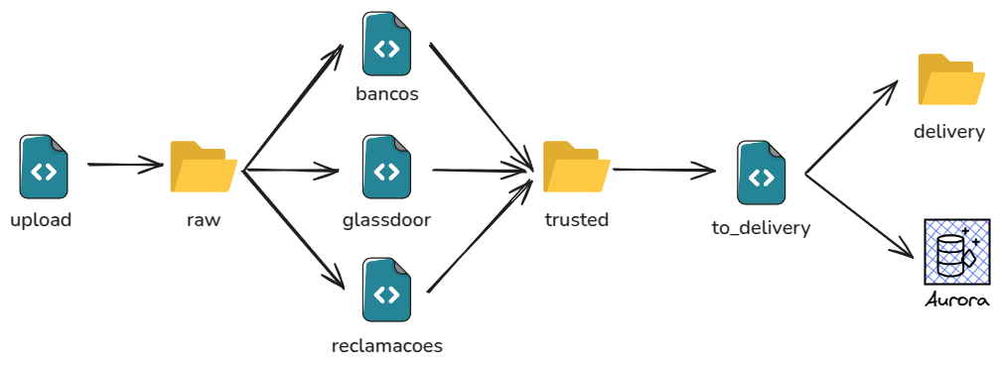

# Atividade 3

## Arquitetura



---

## Scripts

### To Raw

#### upload

Script simples para fazer o upload dos arquivos da source para a camada raw.

Requesitos Mínimos:

- correta tipagem dos dados

---

### To Trusted

#### bancos

Script para limpeza dos dados dos dados de bancos, seguir como base o [script](/atividade2/lambdas/scripts/to_trusted/bancos.py) desenvolvido na atividade 2 com algumas melhorias se necessário.

Requesitos Mínimos:

- correta tipagem dos dados
- renomeação, reordenação e deleção de colunas

    ```
    {
        "CNPJ": "cnpj",
        "Nome": "name",
        "Segmento": "segment",
    }
    ```

- limpeza das colunas de cnpj e nome
    - strip
    - lower case
    - regex
- armazenamento dos resultados na camada do lake correspondente

#### glassdoor

Script para limpeza dos dados dos dados de glassdoor, seguir como base o [script](/atividade2/lambdas/scripts/to_trusted/glassdoor.py) desenvolvido na atividade 2 com algumas melhorias se necessário.

Requesitos Mínimos:

- correta tipagem dos dados
- renomeação, reordenação e deleção de colunas
    ```
    {
        "CNPJ": "cnpj",
        "Nome": "name",
        "Segmento": "segment",
        "employer-revenue": "revenue",
        "reviews_count": "reviews_count",
        "culture_count": "culture_count",
        "salaries_count": "salaries_count",
        "benefits_count": "benefits_count",
        "Geral": "general_score",
        "Cultura e valores": "culture_score",
        "Diversidade e inclusão": "diversity_score",
        "Qualidade de vida": "quality_of_life_score",
        "Alta liderança": "leadership_score",
        "Remuneração e benefícios": "compensation_score",
        "Oportunidades de carreira": "career_opportunities_score",
        "Recomendam para outras pessoas(%)": "recommend_percent",
        "Perspectiva positiva da empresa(%)": "positive_outlook_percent",
        "match_percent": "match_percent"
    }
    ```
- limpeza das colunas de cnpj e nome
    - strip
    - lower case
    - regex
- drop de duplicadas baseado no nome (coluna `"name"`) fazendo a soma dos valores nas colunas `_count` e a média nas demais colunas numéricas e fillna mantendo valor nas colunas de string
- armazenamento dos resultados na camada do lake correspondente

#### reclamacoes

Script para limpeza dos dados dos dados de reclamacoes, seguir como base o [script](/atividade2/lambdas/scripts/to_trusted/reclamacoes.py) desenvolvido na atividade 2 com algumas melhorias se necessário.

Requesitos Mínimos:

- correta tipagem dos dados
- renomeação, reordenação e deleção de colunas
    ```
    {
        "CNPJ IF": "cnpj",
        "Instituição financeira": "name",
        "Categoria": "category",
        "Tipo": "type",
        "Ano": "year",
        "Trimestre": "quarter",
        "Índice": "complaint_index",
        "Quantidade de reclamações reguladas procedentes": "regulated_complaints_upheld",
        "Quantidade de reclamações reguladas - outras": "regulated_complaints_other",
        "Quantidade de reclamações não reguladas": "unregulated_complaints",
        "Quantidade total de reclamações": "total_complaints",
        "Quantidade total de clientes \x96 CCS e SCR": "total_clients_ccs_scr",
        "Quantidade de clientes \x96 CCS": "clients_ccs",
        "Quantidade de clientes \x96 SCR": "clients_scr",
    }
    ```
- limpeza das colunas de cnpj e nome
    - strip
    - lower case
    - regex
- armazenamento dos resultados na camada do lake correspondente

---

### To Delivery and To DB

#### to_delivery

Script para entrega do resultado esperado tanto na camada delivery quanto no banco de dados, seguir como base o [script result](/atividade2/lambdas/scripts/to_delivery/result.py) e [script to_db](/atividade2/lambdas/scripts/to_db/to_db.py) desenvolvido na atividade 2 com algumas melhorias se necessário.

Requesitos Mínimos:

- correta tipagem dos dados
- correta união dos dados (utilizar `inner join`)
    - união de glassdoor com bancos através do cnpj ou do nome
    - com o resultado união com reclamacoes através do cnpj ou do nome
- armazenamento dos resultados na camada do lake correspondente
- armazenamento dos resultados no banco de dados
    - é possível criar o schema no banco utilizando o [script](/atividade2/sql/atividade2.sql), desde as renomeações sejam realizadas de forma correta nas etapas anteriores

---

## Ambiente Local

### Devcontainer

Para rodar o pyspark localmente é necessário seguir o passo à passo do readme de repositório [pyspark-devcontainer](https://github.com/jplane/pyspark-devcontainer). Para rodar um script `.py` ao invés do notebook é necessário rodar o seguinte comando: `spark-submit arquivo.py`
