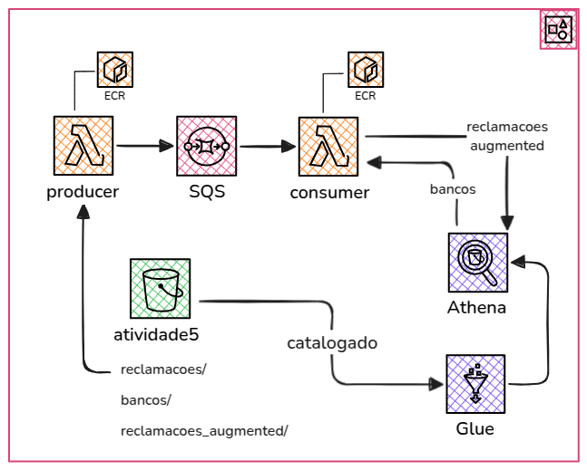

# Atividade 7

## Arquitetura



---

## Requisitos

- [Terraform](https://www.terraform.io/downloads.html) (>= 1.0)
- [Docker](https://docs.docker.com/get-docker/)
- [AWS CLI](https://docs.aws.amazon.com/cli/latest/userguide/getting-started-install.html)

---

## Configuração da AWS

Configure suas credenciais AWS no arquivo `~/.aws/credentials`:

```ini
[mba]
aws_access_key_id = SUA_ACCESS_KEY
aws_secret_access_key = SUA_SECRET_KEY
region = us-east-1
```

---

## Criação do arquivo de variáveis

Crie o arquivo variable.tfvars dentro da pasta terraform com o seguinte conteúdo:

```ini
aws_profile_name="mba"
aws_region="us-east-1"
project_name="atividade7"
```

---

## Como executar

Execute os comandos abaixo dentro da pasta atividade7/terraform:

```ini
terraform init
terraform apply -var-file="variable.tfvars"
terraform destroy -var-file="variable.tfvars"
```